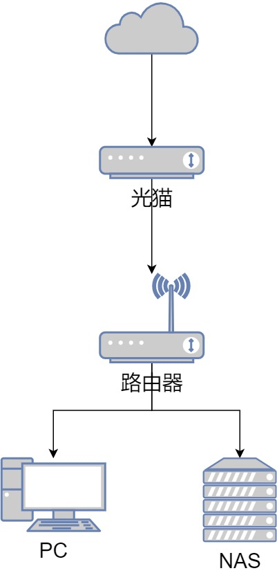
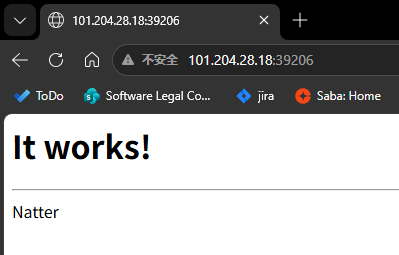

# Natter v2 User Guide

This project aims to help users apply [Natter v2](https://github.com/MikeWang000000/Natter) to open TCP ports in a **Full Cone NAT** network environment, obtain an IPv4 reachable port, and provide some Hook templates.

<p align="right">
Natter Official Communication Group: <a href="https://jq.qq.com/?_wv=1027&k=EYXohGpC">Q 657590400</a> | <a href="https://t.me/+VS5sjOWGgzsyYjY1">TG</a>
</p>

## Basic Usage of Natter

### Prerequisites

1. The network environment NAT must be **Full Cone NAT**, also known as NAT1.

    The following home network environments are likely to be NAT1, for example:

    * Using an optical modem for dialing, but having control over the modem and being able to set DMZ.

    * The optical modem is in bridge mode, using a router for dialing, and having control over the router.

    In the above environments, use [natter-check](https://github.com/MikeWang000000/Natter/blob/master/natter-check/natter-check.py) to perform NAT detection.

    ```bash
    python ./natter-check.py 
    > NatterCheck v2.2.1

    Checking TCP NAT...                  [   OK   ] ... NAT Type: 1
    Checking UDP NAT...                  [   OK   ] ... NAT Type: 1
    ```

    > Note: If you are using any proxy software, turn off TUN before performing the NAT type detection.

2. The ISP has not configured a firewall.

    Generally, we cannot perceive this. Users with the means can use `nmap` from an external network to perform a full TCP port scan on the exit IP; the expected result is that not all ports are closed.

### Tutorial

PS: Due to my router restrictions, I will only explain running Natter on a device connected under a router for now.

#### 1. Running on a device under the router

<p align="center">
    
</p>

This example explains optical modem bridging, with Natter running on a NAS.

1. Download Natter on the device where it will be run.

    Download the version corresponding to your system architecture: https://github.com/MikeWang000000/Natter/releases

    I will use `natter.py` for this demonstration.

2. Configure the network firewall for the device running Natter.

    - Enable DMZ (Recommended)
    
        Enter the router backend, find the DMZ settings, enable DMZ, and set the IP address of the device running Natter as the DMZ host.

        > Note: After enabling DMZ, the device running Natter will be exposed to the public internet, which poses network security risks. Please take precautions.
        > 
        > For example: Change the listening address of self-hosted services from `0.0.0.0` to the internal address `192.168.1.100`; disable password-free access for internal network segments (because traffic forwarded via internal devices is seen as internal access and will skip authentication), etc.

    - Enable Port Forwarding

        Enter the router backend, find the port forwarding settings, add a new port forwarding rule, and map the external port to the internal port of the device running Natter.

        > Due to residential broadband characteristics, external ports change periodically. Manual updates are tedious, so using DMZ or subsequent Hooks to automatically set port forwarding is recommended.

3. Test natter availability.

    First, run `natter.py` directly to see if hole punching is successful.
    ```bash
    python ./natter.py
    2026-06-23 13:44:48 [I] Natter v2.1.1
    2026-06-23 13:44:48 [I] Tips: Use `--help` to see help messages
    2026-06-23 13:44:55 [I] 
    2026-06-23 13:44:55 [I] tcp://192.168.1.100:36741 <--Natter--> tcp://101.204.28.18:39206
    2026-06-23 13:44:55 [I] 
    2026-06-23 13:44:55 [I] Test mode in on.
    2026-06-23 13:44:55 [I] Please check [ http://101.204.28.18:39206 ]
    2026-06-23 13:44:55 [I] 
    2026-06-23 13:44:55 [I] LAN > 192.168.1.100:36741   [ OPEN ]
    2026-06-23 13:44:55 [I] LAN > 192.168.1.100:36741   [ OPEN ]
    2026-06-23 13:44:55 [I] LAN > 101.204.28.18:39206   [ OPEN ]
    2026-06-23 13:44:55 [I] WAN > 101.204.28.18:39206   [ OPEN ]
    2026-06-23 13:44:55 [I]
    ```
        Visit `http://101.204.28.18:39206` to see if the test page can be accessed normally.

    <p align="center">
      
    </p>

    If it can be accessed, it means the current network can normally use Natter for hole punching.

4. Hole punching for internal services.

    Next, we will perform hole punching for an internal service. Suppose the internal service we want to punch is `192.168.1.100:18888`. We use the parameter `-p 18888` to specify the internal service port (Natter will forward data to this port) and `-t 192.168.1.100` to specify the internal IP address of the forwarding target.

    If the device running Natter has multiple network cards or multiple IPs, you can use `-i` to specify the network card name or local IP address Natter binds to; if unsure, you can generally omit `-i`.

    ```bash
    python ./natter.py -t 192.168.1.100 -p 18888
    2026-06-23 14:09:07 [I] Natter v2.1.1
    2026-06-23 14:09:13 [I] 
    2026-06-23 14:09:13 [I] tcp://192.168.1.100:18888 <--socket--> tcp://192.168.1.100:40645 <--Natter--> tcp://101.204.28.18:38010
    2026-06-23 14:09:13 [I] 
    2026-06-23 14:09:13 [I] LAN > 192.168.1.100:18888   [ OPEN ]
    2026-06-23 14:09:13 [I] LAN > 192.168.1.100:40645   [ OPEN ]
    2026-06-23 14:09:13 [I] LAN > 101.204.28.18:38010   [ OPEN ]
    2026-06-23 14:09:14 [I] WAN > 101.204.28.18:38010   [ OPEN ]
    2026-06-23 14:09:14 [I]
    ```

    Then visit the WAN address printed in the log: `101.204.28.18:38010`. If you can access the internal service, the hole punching was successful.

    It is recommended to target a Web service for easy verification, such as qBittorrent Web, etc.

    > Detailed parameters: [Natter Usage](https://github.com/MikeWang000000/Natter/blob/master/docs/usage.md)

#### 2. Running on the router

**To be supplemented** (PRs are welcome~)

## Advanced Usage

If you have mastered the basic use of Natter and want to explore more advanced features, please refer to the following.

### 1. Forwarding Modes

Natter provides several ways to forward Natter port traffic to a target port.

> In general:
> 
> iptables is the most recommended forwarding method.
> 
> If you are not a Linux user, you can choose socat, gost, or socket methods.
> 
> The socket method is the default forwarding method used by Natter.

| &nbsp;       | iptables | nftables | socat   | gost    | socket  |
| ------------ | -------- | -------- | ------- | ------- | ------- |
| OS Limit | Linux only | Linux only | Cross-platform | Cross-platform | Cross-platform |
| Preserve Source IP | Yes | Yes | No | No | No |
| Forwarding Efficiency | High | High | Medium | Medium | Medium |
| Forwarding Type | Kernel | Kernel | Multi-process | Coroutine | Multi-thread |
| Root Permission | Required | Required | Not required | Not required | Not required |
| Third-party Dependency | Yes | Yes | Yes | Yes | No |
| Min Dependency Version | 1.4.1 | 0.9.0 | 1.7.2 | 2.3 | - |
| Best Dependency Version | ≥ 1.4.20 | ≥ 1.0.6 | ≥ 1.7.2 | ≥ 2.3 | - |

If the device running Natter is a Linux system, it is recommended to use iptables forwarding; `sudo` privileges are required to run Natter.

> Detailed differences: [Forwarding Modes](https://github.com/MikeWang000000/Natter/blob/master/docs/forward.md)

### 2. Background Persistence & Auto-run on Boot

- Use tools like `screen` or `tmux` to run Natter in the background to avoid Natter exiting when the terminal is closed.

- Add the following command to the boot script: `echo "sudo-password" | sudo -S nohup /home/zooter/scripts/nas/nat/natter.py -m iptables -p 18888 -i 192.168.1.100 -e /home/zooter/scripts/nas/nat/vscode-hook.py &`

- Run using Docker (Recommended)

    ```bash
    docker run -d \
        --net=host \
        --cap-add=NET_ADMIN \
        --cap-add=NET_RAW \
        --restart=always \
        --name natter \
        nattertool/natter -m iptables -p 18888 -i 192.168.1.100
    ```
    Or use Docker Compose

    ```yaml
    version: '3.8'

    services:
      natter:
        image: nattertool/natter
        container_name: natter
        restart: always
        network_mode: host
        cap_add:
          - NET_ADMIN
          - NET_RAW
        command: -m iptables -p 18888 -i 192.168.1.100
    ```

    View hole punching information:
    ```bash
    docker logs natter
    2026-06-23 07:31:50 [I] Natter v2.2.1
    2026-06-23 07:31:57 [I] 
    2026-06-23 07:31:57 [I] tcp://192.168.1.100:18888 <--iptables--> tcp://192.168.1.100:41177 <--Natter--> tcp://101.204.28.18:40232
    2026-06-23 07:31:57 [I] 
    2026-06-23 07:31:57 [I] LAN > 192.168.1.100:18888   [ OPEN ]
    2026-06-23 07:31:57 [I] LAN > 192.168.1.100:41177   [ OPEN ]
    2026-06-23 07:31:57 [I] LAN > 101.204.28.18:40232   [ OPEN ]
    2026-06-23 07:32:13 [I] WAN > 101.204.28.18:40232   [ OPEN ]
    2026-06-23 07:32:13 [I]
    ```

### 3. Hook Calls

Natter supports Hook calls, which means executing a script after hole punching is successful.

Using this, we can automatically log into the router and set up port forwarding after successful hole punching to achieve automation, such as: automatically setting port forwarding, automatically modifying qBittorrent transmission ports, configuring message notifications, etc.

The following provide some usage templates; they are recommended only for users who enjoy tinkering. PRs are welcome!

* [Automatically set port forwarding](https://github.com/1368129224/Natter-User-Guide/blob/main/template/auto_forward/auto_forward.md)

    Applicable to OpenWRT routers with [UCI](https://openwrt.org/docs/guide-user/base-system/uci) systems for automatic port forwarding.

* [Automatically set qBittorrent transmission port](https://github.com/1368129224/Natter-User-Guide/blob/main/template/qBittorrent/qBittorrent.md)

    Automatically modifies the qBittorrent transmission port to improve connectivity.

## Thanks

* [Natter](https://github.com/MikeWang000000/Natter)
