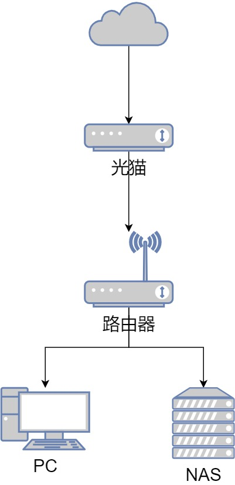

# Natter 使用指南

本项目旨在帮助大家应用 [Natter v0.9](https://github.com/MikeWang000000/Natter/tree/v0.9) ，在 **Full Cone NAT** 网络环境下打开 TCP 端口，获得在 IPv4 可连接的端口，并提供一些Hook的模板。

<p align="right">
Natter 官方交流群组：<a href="https://jq.qq.com/?_wv=1027&k=EYXohGpC">Q 657590400</a> | <a href="https://t.me/+VS5sjOWGgzsyYjY1">TG</a>
</p>

## Natter 基本使用

### 前提条件

1. 网络环境 NAT 为 **Full Cone NAT**，又称 NAT1。

    以下家庭网络环境很有可能是 NAT1 ，例如：

    * 使用光猫拨号，但拥有光猫控制权，能够设置DMZ。

    * 光猫为桥接模式，使用路由拨号，拥有路由控制权。

    处于以上环境时，使用 [NatTypeTester](https://github.com/HMBSbige/NatTypeTester) 进行 NAT 检测，结果为下图便可以继续后续步骤。

2. 运营商没有配置防火墙

    一般我们无法感知，有条件的用户可以使用 `nmap` 在外部网络对出口IP进行 TCP 全端口扫描，期望结果是不为全部关闭。

### 使用教程

PS：由于我的路由限制，暂时只讲解在路由下挂设备上运行 Natter 。

#### 在路由下挂设备上运行



本例讲解光猫桥接，且在 NAS 上运行 Natter 。

1. 在准备运行 Natter 的设备上下载源码
```shell
# 下载源码
git clone https://github.com/MikeWang000000/Natter.git
# 进入Natter目录
cd Natter/
# 切换到v0.9版本
git checkout v0.9
```

2. 编辑配置文件

    复制 `natter-config.template.json` 并重命名为 `config.json`，根据注释填写配置，参考 `config.template.json`。PS：json 不支持注释，请不要在配置文件中添加注释。

    这里我们采用仅打洞方式，手动设置端口转发。如：在 "open_port" -> "tcp" 中添加 "0.0.0.0:50000"。
    ```
    {
        "logging": {
            "level": "info", // 日志等级：可选值："debug"、"info"、"warning"、"error"
            "log_file": "./natter.log" // 日志文件路径，不需要日志则置空：""
        },
        "status_report": {
            "hook": "bash ./natter-hook.sh '{protocol}' '{inner_ip} ' '{inner_port} ' '{outer_ip}' '{outer_port}'", // Hook文件路径
            "status_file": "./natter-status.json" // 实时端口映射状态储存至指定文件，不 需要则置空：""
        },
        "open_port": {
            // 此处设置 Natter 打洞IP:端口。（仅打洞）
            // 此处地址为 Natter 绑定（监听）的地址，Natter 仅对这些地址打洞，您需要手动    设置端口转发。
            // 注意：使用默认出口IP，请使用 0.0.0.0 ，而不是 127.0.0.1 。
            "tcp": [
                "0.0.0.0:50000"
            ],
            "udp": [
            ]
        },
        "forward_port": {
            // 此处设置需要 Natter 开放至公网的 IP:端口。（打洞 + 内置转发）
            // Natter 会全自动打洞、转发，您无需做任何干预。
            // 注意：使用本机IP，请使用 127.0.0.1，而不是 0.0.0.0 。
            // 注意：我们采用仅打洞方式，不使用内置转发，清空所有规则
            "tcp": [
            ],
            "udp": [
            ]
        },
        "stun_server": {
            // 此处设置公共 STUN 服务器。
            // TCP 服务器请确保 TCP/3478 端口开放可用；
            // UDP 服务器请确保 UDP/3478 端口开放可用。
            // 一般无需改动
            "tcp": [
                "fwa.lifesizecloud.com",
                "stun.isp.net.au",
                "stun.freeswitch.org",
                "stun.voip.blackberry.com",
                "stun.nextcloud.com",
                "stun.stunprotocol.org",
                "stun.sipnet.com",
                "stun.radiojar.com",
                "stun.sonetel.com",
                "stun.voipgate.com"
            ],
            "udp": [
                "stun.miwifi.com",
                "stun.qq.com"
            ]
        },
        // 此处设置 HTTP Keep-Alive 服务器。请确保该服务器 80 端口开放，且支持 HTTP     Keep-Alive。
        "keep_alive": "www.qq.com"
    }
    ```

3. 运行 Natter

    配置完成后的目录结构: 
    ```
    .
    ├── config.json
    ├── natter-hook.sh
    └── natter.py
    ```

    由于 STUN 特性，需要后台运行以保持长连接，这里建议使用 `screen` 来运行 Natter ，且可以随时切回。

    ```shell
    # 新建screen，名为nat
    screen -S nat

    # 运行脚本
    python natter.py -c ./config.json

    # 离开screen
    按 Ctrl + A 再按 Ctrl + D

    # 回到screen
    screen -r nat
    ```
    运行成功后会有以下打印
    ```
    [INFO] - >>> [TCP] ('192.168.1.100', 50000) -> ('61.157.1.123', 46087) <<<
    [Script] - Upload to server: tcp: 192.168.1.100:50000 -> 61.157.1.123:46087
    ```
    至此，我们完成了内网 `192.168.1.100:50000` 到外网 `61.157.1.123:46087` 的 TCP 打洞，接下来需要在路由中设置端口转发把 `50000` 转发到目标的端口上。

4. 修改端口转发

    进入路由器后台，防火墙->端口转发->新建规则，进行如下设置：
    ```
    来源：WAN
    来源端口：50000
    目标：LAN
    目标地址：内网设备IP地址
    目标端口：内网设备提供服务的端口
    ```

5. 验证

    建议将目标指向到web服务，方便访问以检测打通是否成功，如：qBittorrent web等。

#### 在路由上运行

*待补充*

## 高级用法

[Natter v0.9](https://github.com/MikeWang000000/Natter/tree/v0.9) 支持了Hook调用，即在打洞成功后执行脚本。

利用这一点，我们可以在打洞成功后自动登录到路由器并设置端口转发，实现一些自动化功能，例如：自动设置端口转发、自动修改 qBittorrent 传输端口、配置消息推送等。

以下提供一些使用模板，仅建议愿意折腾的小伙伴使用，欢迎大家PR！

* [自动设置端口转发](https://github.com/1368129224/Natter-User-Guide/blob/main/template/auto_forward/auto_forward.md)

    适用于具有 [UCI](https://openwrt.org/zh/docs/guide-user/base-system/uci) 系统的 OpenWRT 路由器，自动设置端口转发。

* [自动设置 qBittorrent 传输端口](https://github.com/1368129224/Natter-User-Guide/blob/main/template/qBittorrent/qBittorrent.md)

    自动修改 qBittorrent 传输端口，提高连通性。

* [使用 message-pusher 进行推送消息](https://github.com/1368129224/Natter-User-Guide/blob/main/template/push/push.md)

    使用 [message-pusher](https://github.com/songquanpeng/message-pusher) 在网络环境改变时进行消息推送。

## Thanks

* [Natter](https://github.com/MikeWang000000/Natter)
* [NatTypeTester](https://github.com/HMBSbige/NatTypeTester)
