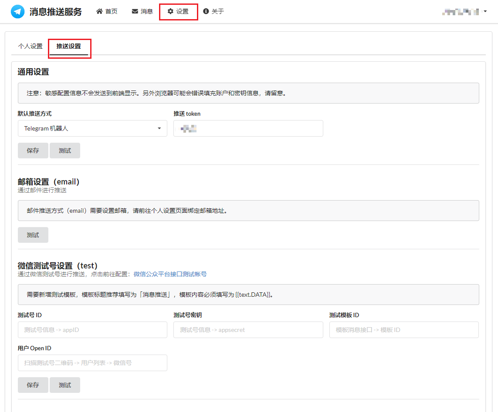
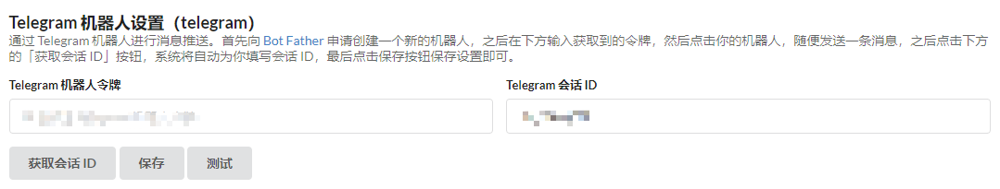
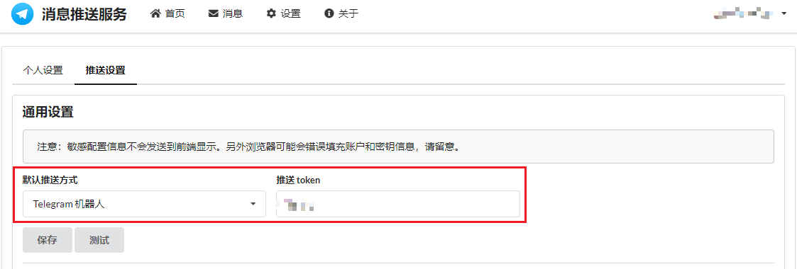

# 配置消息推送

[message-pusher](https://github.com/songquanpeng/message-pusher) 是一个消息推送服务，目前官方服务免费公开使用，支持多种推送方式：
> * 邮件消息，
> * 微信测试号，
> * 企业微信应用号，
> * 企业微信群机器人
> * 飞书群机器人，
> * 钉钉群机器人，
> * Bark App,
> * WebSocket 客户端（官方客户端，接入文档），
> * Telegram 机器人，
> * Discord 群机器人，

官方服务站：https://msgpusher.com/

> 为什么不使用 `Server酱`？ 
> 
> Server酱每天只有5条免费推送额度，如果运营商网络频繁变动，免费额度不满足使用。

## 准备

1. 打开官方服务站，并注册账号，进入推送设置。

2. 根据需要和帮助信息配置需要的推送方式，并修改默认推送方式。这里我配置的是tg推送，并将默认推送方式改为tg。


PS：如果设置了 推送token ，请记下来，后续推送时需要配置。

## 配置

参考 `push.template.sh` 修改你的Hook。
1. 替换用户名和推送token。
2. 根据需求选择推送函数，如：`send_message` 向默认频道发送消息。
3. 根据需求更改'title' 'description' 'content'。

```shell
MESSAGE_PUSHER_SERVER="https://msgpusher.com"
MESSAGE_PUSHER_USERNAME="your username"
MESSAGE_PUSHER_TOKEN="your token"

function send_message {
  # 向默认频道发送消息
  curl -s -X POST "$MESSAGE_PUSHER_SERVER/push/$MESSAGE_PUSHER_USERNAME" \
    -d "title=$1&description=$2&content=$3&token=$MESSAGE_PUSHER_TOKEN" \
    >/dev/null
}

function send_message_email {
  # 向邮箱发送消息
  curl -s -X POST "$MESSAGE_PUSHER_SERVER/push/$MESSAGE_PUSHER_USERNAME" \
    -d "title=$1&description=$2&content=$3&token=$MESSAGE_PUSHER_TOKEN&channel=email" \
    >/dev/null
}

function send_message_with_json {
  # 发送JSON格式的消息
  curl -s -X POST "$MESSAGE_PUSHER_SERVER/push/$MESSAGE_PUSHER_USERNAME" \
    -H 'Content-Type: application/json' \
    -d '{"title":"'"$1"'","desp":"'"$2"'", "content":"'"$3"'", "token":"'"$MESSAGE_PUSHER_TOKEN"'"}' \
    >/dev/null
}

send_message 'title' 'description' 'content'
```